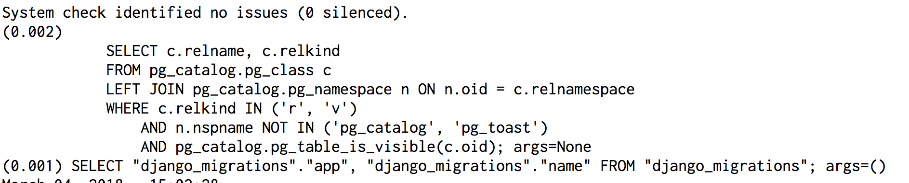
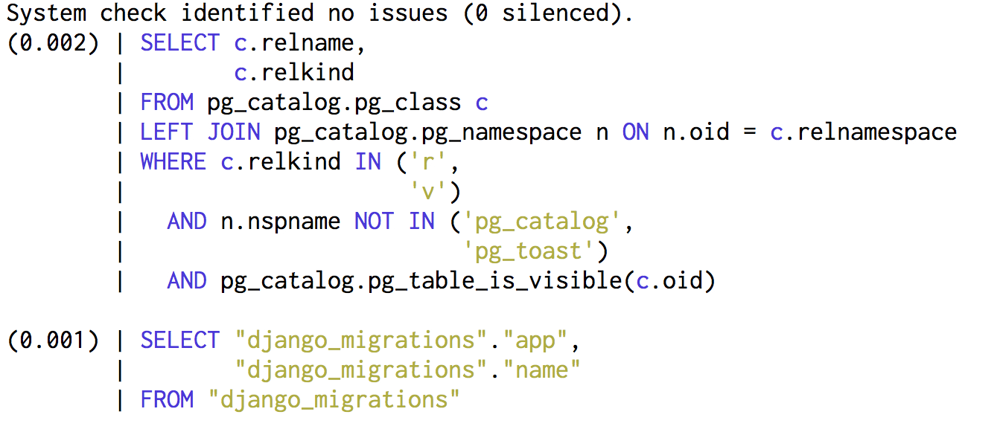

# Django SQL Formatter

Format (sqlparse) and syntax highlight (pygments) SQL queries in Django.

#### Install

    pip install django-sqlformatter

#### Configure

```python
LOGGING = {
    'version': 1,
    'disable_existing_loggers': False,
    'formatters': {
        'sql': {
            '()': 'django_sqlformatter.SqlFormatter',
        },
    },
    'handlers': {
        'console': {
            'level': 'DEBUG',
            'class': 'logging.StreamHandler',
            'formatter': 'sql',
        },
    },
    'loggers': {
        'django.db.backends': {
            'handlers': ['console'],
            'level': 'DEBUG',
        }
    }
}
```

---

#### Before



#### After


